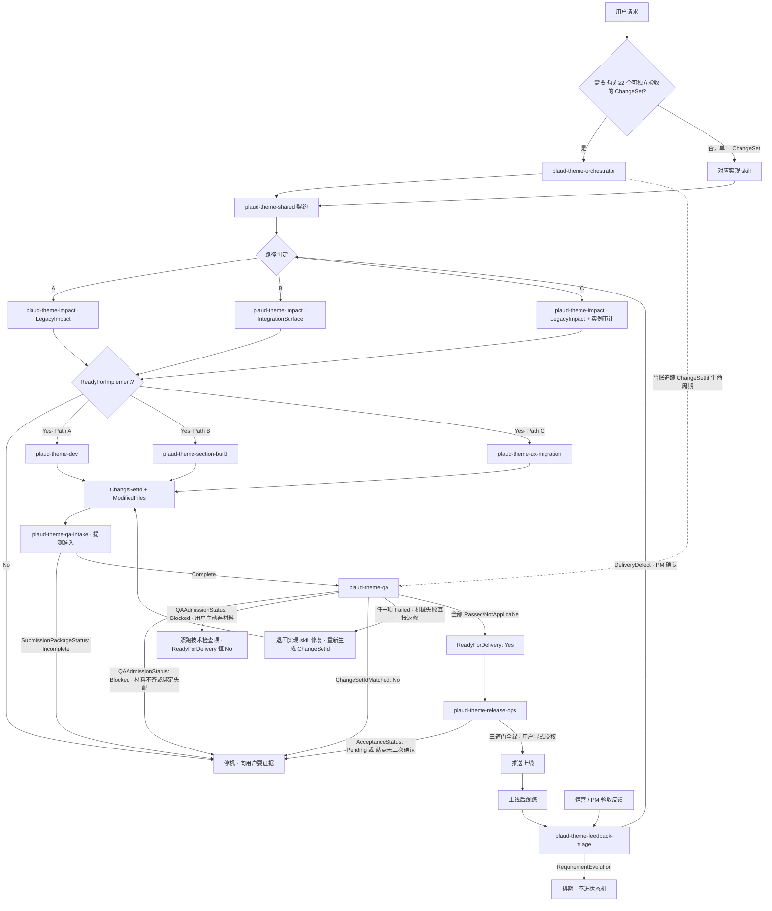

# Skill Matrix — PLAUD Shopify Theme

All listed skills live directly under the package root. The outer
`plaud-shopify-theme-matrix-v0.2.0` directory is a distribution package, **not** an
installable skill — never copy the package root itself into a skills directory.

## Order

| Order | Skill | Purpose | Main Consumer |
|---:|---|---|---|
| 0 | `plaud-theme-shared` | 契约层：两轴状态机、handoff schema、ChangeSetId 绑定、交付权归属、全路径红线、视觉/UX 基线索引、版本清单 | 矩阵内全部 skill |
| 1 | `plaud-theme-orchestrator` | 全流程编排：路径判定、阶段推进、多块拆分与串并行、工件台账 | 用户（仅大/跨块任务） |
| 2 | `plaud-theme-impact` | Assess 阶段：影响面侦察，理论引用 vs 实际实例、依赖树、共享传播链、RiskTier | 三个实现 skill / orchestrator |
| 3 | `plaud-theme-dev` | Path A Implement：bug、性能、新功能、UX 微调、A11y、code review | `plaud-theme-qa` |
| 4 | `plaud-theme-section-build` | Path B Implement：Figma → `sa-*` section，schema、vendor 规范 | `plaud-theme-qa` |
| 5 | `plaud-theme-ux-migration` | Path C Implement：UX Spec v1.3 迁移、刷模块、迁移日志 | `plaud-theme-qa` |
| 6 | `plaud-theme-qa-intake` | 提测准入：DTC §四 六项交付物、站点清单、包指纹；**材料不齐 QA 不启动** | `plaud-theme-qa` |
| 7 | `plaud-theme-qa` | Verify 阶段：Theme Check baseline 增量、5 断点回归、多语言、A11y、红线核查 —— **唯一交付权** | 用户 / `release-ops` |
| 8 | `plaud-theme-feedback-triage` | 反馈归因：DTC §六 交付缺陷 vs 需求演进、依据、去向、Linear 状态建议 | 用户 / PM |
| 9 | `plaud-theme-release-ops` | 发版与上线后：DTC §五 推站二次确认、PR、线上 bug 时效、回归用例入库 | 用户 |

## 入口暴露

不是十个平级入口：

- **正常用户入口** — `plaud-theme-dev` / `plaud-theme-section-build` / `plaud-theme-ux-migration`
- **全流程入口** — `plaud-theme-orchestrator`。唯一门槛是**这件事必须拆成 ≥2 个能各自独立验收的 ChangeSet**：迁移 wave、多块并行/串行编排、Cross(A+C) 的裂块，或用户明确要求把这样一批工作端到端管起来。
  Cross(B+C) **不裂块**（一个 Path B 块 + C 的 spec 取值 + QA-B/QA-C），单个这样的任务直接走 `plaud-theme-section-build`。
  「触及共享 snippet / 全局 CSS / token / build 产物」本身**不是**进入条件，「要走完 Assess → Implement → Verify」本身也**不是** —— 单一 ChangeSet 一律走单 skill。**普通 bugfix 不绕 orchestrator。**
- **阶段能力 / 专家入口** — `plaud-theme-shared`、`plaud-theme-impact`、`plaud-theme-qa`
- **运营协作入口**（v0.2.0 新增）— `plaud-theme-qa-intake`（提测材料）、`plaud-theme-feedback-triage`（反馈算缺陷还是变更）、`plaud-theme-release-ops`（发版与上线后）。三者**均不占阶段轴**

## 两轴状态机（阶段 × 路径）

路径决定「按什么规则实现」，阶段决定「现在处于评估、实现还是验证」。
本表是 `plaud-theme-shared/references/handoff-schema.md` §0 的投影；字段冲突以 handoff-schema 为准。

| 阶段 | Path A（通用开发） | Path B（Figma section） | Path C（UX 迁移） |
|---|---|---|---|
| **Assess** | `plaud-theme-impact`（`LegacyImpact`） | `plaud-theme-impact`（`IntegrationSurface`） | `plaud-theme-impact`（`LegacyImpact` + 迁移实例审计） |
| **Implement** | `plaud-theme-dev` | `plaud-theme-section-build` | `plaud-theme-ux-migration` |
| **Verify** | `plaud-theme-qa`（QA-A + QA-Global） | `plaud-theme-qa`（QA-B + QA-Global） | `plaud-theme-qa`（QA-C + QA-Global） |

> Implement 与 Verify 之间还夹着 `plaud-theme-qa-intake` 的提测准入门（不占阶段轴，见下节）。

阶段单向推进 `Assess → Implement → Verify`。跳过 Assess 的唯一情形是 `InlineLite` 豁免
（四个条件见 handoff-schema §3，须全部满足）。**任何情况下不得跳过 Verify。**

### 阶段轴之外的四个 skill

阶段轴**恒为三值**，v0.2.0 新增的三个 skill 与 orchestrator 一样不占阶段轴：

| skill | 位置 | 工件 | 阻断能力 |
|---|---|---|---|
| `plaud-theme-orchestrator` | 编排 | `Coordination` | 无（只记台账） |
| `plaud-theme-qa-intake` | **Implement → Verify 的过渡关口** | `QAIntake` | **有**：提测包不全 → QA 零验证项执行 |
| `plaud-theme-feedback-triage` | 事件入口（任意时点） | `FeedbackTriage` | 无（但会新开工作项回 Assess） |
| `plaud-theme-release-ops` | Verify 之后 | `ReleaseOps` | 无（前置是 QA 的 `ReadyForDelivery: Yes`） |

> 🔴 **不得把 qa-intake 当成第四个阶段。** 写 `Stage: Handover` 之类的取值一律违规。
> 它在 Verify **之前**的理由是 DTC §四 原文：「提测时必须同时提供，**缺一不进验收**」——交付物是进验收的准入条件，不是验收的产物。

### 路径判定

```
用户请求
  ├─ 含 Figma / 设计稿 / 新建 sa-* / Section AI？    → Path B
  ├─ 含 UX Spec v1.3 / 刷模块 / spec 迁移 / 对齐 ux？  → Path C
  └─ 否则（bug / 性能 / 新功能 / UX 微调 / review / A11y） → Path A
```

交叉场景以更具体的规范优先：

- **Cross(B+C)** — 走 B 的实现规则 + C 的 spec 取值，`Path` 填 `B`，**单一 `ChangeSetId`**，QA profile 为 QA-B + QA-C + QA-Global。不裂块。
- **Cross(A+C)** — A 与 C 的实现规则和 QA profile 不同，由 `plaud-theme-orchestrator` 裂成 A 块与 C 块，各自 `ChangeSetId`、各自 QA profile。
Path A 的质量规则（全路径红线）全局继承，永远适用。

## 工件流

| 阶段 | 产出方 | 关键工件 | 消费方 |
|---|---|---|---|
| Assess | `plaud-theme-impact` | `AssessmentRef`（`ASMT-<YYYYMMDD>-<NN>`）、`ReadyForImplement` | 实现 skill / orchestrator |
| Implement | dev / section-build / ux-migration | `ChangeSetId`（`CS-<YYYYMMDD>-<path><NN>`）、`ModifiedFiles`、`BaseHeadSha`、`ChangeSetFingerprint`、`RequiredQAProfile`（共 19 字段） | **`plaud-theme-qa-intake`** |
| 提测（过渡） | `plaud-theme-qa-intake` | `SubmissionId`（`SUB-<YYYYMMDD>-<NN>`）、`PackageFingerprint`、`TargetSites`、`ThemeIds`、六项材料的 `Complete/Incomplete` | `plaud-theme-qa` |
| Verify | `plaud-theme-qa` | `QAAdmissionStatus`、`ChangeSetIdMatched`、逐项 Passed/Failed/Blocked/NotApplicable、`Advisories`、`ReadyForDelivery`（共 24 字段） | 用户 / `release-ops` / 回退到实现 skill |
| 反馈（事件） | `plaud-theme-feedback-triage` | `TriageId`（`TRI-…`）、`ClassificationRecommendation`、`EvidenceRefs`、`PMDecision`、`NextRoute` | PM / 新工作项回 Assess |
| 发版 | `plaud-theme-release-ops` | `ReleaseId`（`REL-…`）、`ReleaseScope`（逐块 QA 结论 + 验收状态）、`IntegrationQARef`、`TargetSites`、`ThemeIds`、`SiteListConfirmedBy`、`AuthorizationRef`、`PushResult`、`RegressionCasesAdded` | 用户（推送需显式授权） |

## Flow



`plaud-theme-orchestrator` 与 `plaud-theme-qa` 之间是虚线：orchestrator 只**读** QA 结果记台账，
**不产生**交付许可。

> 🔴 **两种"打回"的路由不同，别混：**
>
> | 来源 | 路由 |
> |---|---|
> | **QA 的机械失败**（Theme Check、断点回归、A11y、写死宽高…） | **直接回实现 skill 返修** + 新 `ChangeSetId`。**不进 feedback-triage** —— 没有"缺陷还是变更"可判 |
> | **运营 / PM 的验收反馈**（与 Figma 不一致、觉得间距小、想加动效） | 走 `plaud-theme-feedback-triage`，由 PM 判归属 |
>
> 把机械 QA 失败塞进 triage，等于让 PM 去审批一件本来就该修的技术问题。

## 三条不变式

### 1. 每个 skill 必须能独立运行，全流程必须过契约

窄任务直接调对应 skill：只问影响面 → `plaud-theme-impact`；只要验收 → `plaud-theme-qa`；
单个 bug → `plaud-theme-dev`；提测材料齐不齐 → `plaud-theme-qa-intake`；这条反馈算缺陷还是变更 →
`plaud-theme-feedback-triage`；要发版推站 → `plaud-theme-release-ops`。但任何全流程/跨块工作都必须过 `plaud-theme-shared` 契约，
按 handoff-schema 的字段交接。绕开契约的自定义字段、改名字段、新增终态词汇一律无效。

枚举分**两套**（handoff-schema §9.2）：**阶段契约块**里的字段是封闭枚举，`Done` / `Invalidated` / `Partial` 一律违规；
`memory/changeset-log.md` 等**项目记录文件**另有一套取值，`Invalidated` 在那里是合法的。别把两套混用。

### 2. Stop, don't guess

缺证据就停机要材料，不凭经验补齐、不用「通常来说」填空。
典型停机点见 handoff-schema §7：找不到目标文件、模板存值未获授权、spec 值等距两可、
Figma 值无近邻 token、迁移未读踩坑规则、`ChangeSetId` 与工作树不符、无法预览验证。
停机时输出 `BlockingGaps` 并写清需要用户提供什么，**不要**输出半成品再附一句「可能需要确认」。

### 3. 交付权唯一

> **只有 `plaud-theme-qa` 能输出 `ReadyForDelivery: Yes`。**

且 `ReadyForDelivery: Yes` **只代表通过了矩阵内部的技术验证**，它不等于：

| 不代表 | 归谁 |
|---|---|
| 提测材料齐备 | `plaud-theme-qa-intake` 的 `SubmissionPackageStatus` |
| 运营 / PM 已验收 | PM，依据 PRD / Figma / UX Spec（`plaud-theme-feedback-triage`） |
| 可以推送到线上 | `plaud-theme-release-ops` 的站点二次确认 |

四者正交，任何一个都不能替代另一个。QA 通过后仍可能被 PM 判为交付缺陷（如与 Figma 不一致——那是 QA 不检查的维度）。

实现类 skill 恒输出 `ReadyForDelivery: No` + `QAStatus: NotRun`，禁止使用
「交付完成」「上线可用」「全部通过」「可以发布」「已验收」等终态措辞；
允许的说法是「改动已就位，待 QA」。
`Blocked` / `NotRun` 不得折算为 pass。`NotApplicable` **是合法终态**，但必须给出适用性证据
（例如「本次未改任何 `.liquid`，故 Theme Check 不适用」）——无证据的 `NotApplicable` 一律按 `Blocked` 处理。
区别在于：`Blocked` 是「该验但验不了」（风险），`NotApplicable` 是「根本不需要验」（不是风险）。
QA 通过后代码再变，原 QA 自动失效，须重新生成 `ChangeSetId` 重跑。
`plaud-theme-orchestrator` 汇总下辖各 ChangeSet 的 QA 结果，但**汇总不产生交付许可**：它输出的
`AllChangeSetsDelivered` 是纯汇总读数，不是许可，且它的协调工件里根本不出现 `ReadyForDelivery` 字段。
它也不是阶段 producer：不输出 §3/§4/§5 阶段工件，只输出 §9.1 协调工件，且不得伪造阶段事实。

## ChangeSetId 绑定

`ChangeSetId` 把「谁改的」和「谁验的」焊在一起。

- 格式 `CS-<YYYYMMDD>-<path><NN>`，`<path>` ∈ `A`/`B`/`C`
- 生成方：实现 skill；消费方：`plaud-theme-qa`（回填 `ChangeSetIdMatched`）
- 追踪方：`plaud-theme-orchestrator`（只记台账，不生成、不改写）
- **内容绑定**：除文件集合外还绑 `BaseHeadSha`（当时的 HEAD）与 `ChangeSetFingerprint`（覆盖内容、权限、删除态、未跟踪文件）。QA 在执行任何检查**之前**重算并精确比对——文件没多没少但内容变了，只绑文件名会漏掉
- 文件集合、`ChangeSetFingerprint`、`BaseHeadSha` 任一不符 → QA 停机，**不得**「顺便把新改动一起验了」
- 项目侧 `memory/changeset-log.md` 由 `plaud-theme-qa` 维护

## Theme Check 门

`plaud-theme-qa` 的 Theme Check 是 **baseline 增量判定**，不是绝对 pass：
改动前后各跑一次 `shopify theme check`，**两次都跑全仓**，比对**两个**指标：`addedInModifiedFiles`（改动文件内新增）与
`addedOutsideModifiedFiles`（**改动文件之外**新增），**两者都为 0** 才 `Passed`。
只扫改动文件会系统性漏掉外溢——删掉一个被引用的 asset / locale key，offense 会报在**未修改的调用方文件**里。
判定细节与 Blocked 的合法情形见 handoff-schema §6。

## 项目状态文件（`memory/`，不随包分发）

模板清单、模块迁移状态、全局已知偏差、ChangeSet 日志属于**项目运行时状态**，不是规范，
必须存放在项目侧 —— 写进包里会在下次 install 时被整包覆盖。清单见 `plaud-theme-shared/SKILL.md`。
缺失时**停下问用户**，不要凭空重建。
